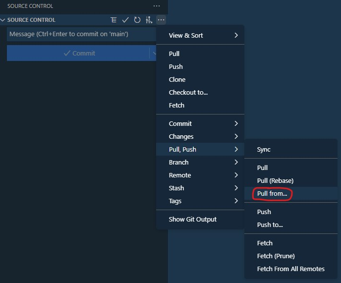

# Integrate changes from sprint branch into local development branch

There are different ways to integrate the changes from a remote sprint branch into your local development branch.

- [Integrate changes from sprint branch into local development branch](#integrate-changes-from-sprint-branch-into-local-development-branch)
  - [When and why would you do this?](#when-and-why-would-you-do-this)
  - [How can you solve this?](#how-can-you-solve-this)
    - [1. Visual Studio Code](#1-visual-studio-code)
    - [2. Graphical Git client](#2-graphical-git-client)
    - [3. Git Bash](#3-git-bash)

## When and why would you do this?

1. You want to see the changes, that other developers in your team have performed and integrate them with your own work.
2. You want to pull in the changes before a Pull-Request, so that you can resolve the merge conflicts in advance locally.

## How can you solve this?

First of all, there are many different solutions and tools exist that can support you. An uncomplete list is below.

1. Visual Studio Code
2. Git Tower, GitKraken or any other graphical Git client
3. Git Bash

### 1. Visual Studio Code

Go to the source control tab and on the three dots at the top (see screenshot). Then navigate to "``Pull, Push``" and "``Pull from...``". In the pop-up, select your origin (usually called origin) and then the branch that you want to pull from (e.g. the sprint branch). Try to select the branch from the origin (prefixed with "origin/") rather than your local copy of the sprint branch that you might have.



If there are merge conflicts, a pop-up will tell you. You will then have to clear the file with conflicts in order to merge the remote branch into yours.

### 2. Graphical Git client

Consult the official documentation for your respective client. For Tower, this could be [here](https://www.git-tower.com/learn/git/ebook/en/desktop-gui/remote-repositories/integrating-remote-changes).

### 3. Git Bash

To use Git Bash, you can look [here](https://stackoverflow.com/questions/20101994/how-to-git-pull-from-master-into-the-development-branch), or for tdlr execute the following commands.

Remember to replace the placeholders. You do not have to run the checkout command if you already are on the respective branch.

``` git bash
git checkout <local-(dev)-branch>
git pull origin <sprint-branch>
```
